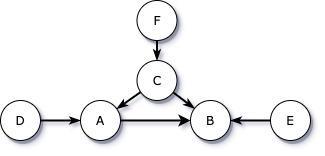
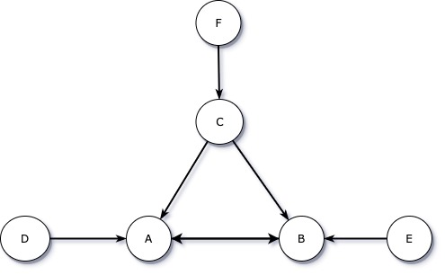

```{r wd}
setwd("/Users/wangpei/OneDrive - National University of Singapore/Curriculum/Sem_04/BT3102/Assignments/Computational-Methods-for-Business-Analytics/Assignment 2/")
getwd()
```

```{r packages, include=FALSE}
library(AER)
library(stargazer)
library(corrplot)
```
# Q1
# Q.1.I 
## Assume Diagram 1 is correct. Choose sensible parameter values and simulate a data set of N=10000 observations for 3 variables: ratings, prices and sales (taste data is removed after the simulation because it is unobserved to the analyst)

```{r Q1.I}
set.seed(37)

N = 10000

taste = sapply(rnorm(N,mean = 5), function(x) {max(x, 0)})
hist(taste)
rating = sapply(rnorm(N, mean = taste) + rnorm(N), function(x) {max(x, 0)})
hist(rating)
price = taste * 10 + rnorm(N, mean = 10, sd = 5)
hist(price)
sales = price * (-2) + taste * 30 + 50 + rnorm(N)
hist(sales)
```

For the DGP, we generate data as follow:
- `taste`: normal distribution with mean 5, and greater than 0.
- `rating`: Based on customer behaviors, they are most likely to rate based on taste evaluations. `rating` is from normal distribution with mean being the value of taste, and greater than 0.
- `price`: Wine with better taste tends to have a higher price due to higher quality. `price` positively depends on taste with random error of mean 10, standard deviation 5.
- `sales`: Sales should positively depend on taste evaluations, and negatively depend on price.

## Q1.II.1 Regress `sales` on `price`
```{r Q1.II.1}
lm_sales_on_price = lm(sales~price)
summary(lm_sales_on_price)$coefficients
# Due to omitted variable bias.
```

The coefficient estimate of price is 0.4107, and it's significantly different from -2. Thus, we conclude this coefficient is biased, and using price as the only independent variables is insufficient.

This is because `taste` is correlated with both `price` and `sales`, thus omitting `taste` results in omitted variable bias.

## Q1.II.2 Include `rating` as independent variable
```{r Q1.II.2}
lm_sales_on_price_and_rating= lm(sales ~ price + rating)
summary(lm_sales_on_price_and_rating)$coefficients
# Does not help
cor(rating, price) # 0.5192752
cor(rating, sales) # 0.4074834
```

The coefficient of price is 0.1922, which is significantly different from -2 and is still biased.

This is because omitted variable bias still exists. Including rating does not help. 
??????????????????????????????????????????????????????????????????????????????????

## Q1.III
```{r Q1 III DGP}
rm(list=ls())
set.seed(37)
N = 10000

taste = sapply(rnorm(N,mean = 5), function(x) {max(x, 0)})
hist(taste)
rating = sapply(rnorm(N, mean = taste) + rnorm(N), function(x) {max(x, 0)})
hist(rating)
price = rating * 10 + rnorm(N, mean = 10, sd = 5)
hist(price)
sales = price * (-2) + taste * 30 + 50 + rnorm(N)
hist(sales)
```

The DGP is similar as part(I), except that one parent of price changes from taste to rating.

```{r Q1.III.1}
lm_sales_on_price = lm(sales ~ price)
summary(lm_sales_on_price)$coefficients  # there is omitted variable bias  

```
The coefficient is -1.0677, which is significantly different from -2, the estimate is biased due to omitted variable bias. `taste` is correlated with sales, and is also correlated with `price`  through rating, thus omitting `taste` will result in omitted variable bias.

```{r Q1.III.2}
lm_sales_on_price_and_rating= lm(sales ~ price + rating)
summary(lm_sales_on_price_and_rating)$coefficients  # ok
```
The coefficient of price is -2.0540, which is close to the true value of -2. The omitted variable bias is resolved by including `rating`.

This is because when `rating` is held constant/controlled for, `taste` cannot affect `price` via `rating`, therefore the error term is not correlated with `price`, and the estimate is correct.

# Q2
## 2.I
Data generating process: 
$$
\begin{aligned}
\alpha_1 &=0 \\
\alpha_2=\alpha_3=\beta_1 &=\beta_2=\beta_3=\gamma=1
\end{aligned}
$$

```{r Q2.1 DGP}
set.seed(37)
N = 10000

D = rnorm(N)
E = rnorm(N)
F = rnorm(N)
a1=0
a2=a3=b1=b2=b3=g=1

C = g*F + rnorm(N)
A = 0 + a2*C + a3*D + rnorm(N)
B = b1*A + b2*C + b3*E + rnorm(N)
C_measured = C + rnorm(N)
D_measured = D + rnorm(N)
A_measured = A + rnorm(N)
```

### 2.I.1 Draw causal diagram



- A is correlated with B,C,D,F; depends directly on D,C, indirectly on F.

- B is correlated with A,C,D,E,F; depends directly on A,C,E, indirectly on F,D.

- C is correlated with A,B,F; depends directly on F.

- D is correlated with A,B; depends on nothing (exogenous).

- E is correlated with B; depends on nothing (exogenous).

- F is correlated with A,B,C; depends on nothing (exogenous).

### 2.I.2 Show all collider variables and how they may bias estimates.

Collider variables are variables with multiple parents.

A is a collider variable, it will cause endogenous selection bias if added into regressions of D and C (i.e. D ~ C+A, C ~ D+A yield biased estimates.)

B is a collider variable, it will cause endogenous selection bias if added into regressions of A, C, E. (i.e. C ~ E+B, E ~ C+B, A ~ C+B, C ~ A+B, A ~ E+B, E ~ A+B, etc.)

### 2.I.3 Which variables to include to predict A? Is the model also a good causal inference model?

To predict A, we can include D and C by regressing A on D and C (A ~ D+C). It is also a good model for causal inference as it captures the true relationship between A between D and C. This is because there is no endogeneity problem as all parents of A are included in the regression model.

### 2.I.4 Show whether or not each of following data is enough to identify relation between A and B.
```{r Q2.1.4}
lm1 = lm(B ~ A+C) # ok
lm2 = ivreg(B ~ A|D) # ok
lm3 = lm(B ~ A+E) # bad, omitted variable bias by C
lm4 = lm(B ~ A+F) # bad, omitted variable bias by C
lm5 = lm(B ~ A+C_measured) # bad, measurement error
lm6 = ivreg(B ~ A|D_measured) # ok, but not so accurate
lm7 = ivreg(B ~ A_measured|D) # ok
lm8 = lm(B ~ A_measured+C) # bad, measurement error by A

stargazer(lm1,lm2,lm3,lm4,lm5,lm6,lm7,lm8,
          type="text",omit.stat=c("LL","ser","f"),
          model.numbers=TRUE, model.names = TRUE)
```

Comments on models:

- a: Enough. B ~ A + C can identify relation between A and B because E is exogenous and C, which is endogenous, is included in the regression.

- b: Enough. B ~ A | D can identify relation between A and B because D is a good instrumental variable as it strongly correlates with A and it correlates with B only through A. 

- c: Not enough. B ~ A + E cannot identify relation between A and B due to omitted variable bias. C effects both A and B and is omitted in the regression.

- d: Not enough. B ~ A + F cannot identify relation between A and B because C is omitted in the regression, causing omitted variable bias, and F cannot be a instrumental variable as it correlates with B not only through A.

- e: Not enough. B ~ A + C_measured cannot identify relation between A and B. This is because:
$$
\begin{aligned}
&A = a_0 + a_1C + \epsilon_1 \\
&B = b_0 + b_1 A + b_2 C + \epsilon_2 \\
&C^* = C + \epsilon_3 \\
\implies 
&A = a_0 + a_1 C^* + (\epsilon_1 - a_1 \epsilon_3) \\
&B = b_0 + b_1 A + b_2 C^* + (\epsilon_2 - b_2 \epsilon_3)
\end{aligned}
$$

The error term of B ~ A+C* is correlated C* and A. Thus, the estimation for b1 and b2 are biased.

- f: Enough. B ~ A | D_measured can identify the relation between A and B but D_measured is a weaker instrumental variable than D. As shown below, the correlation between A and D_measured is 0.3518, so the estimation bias is larger than B ~ A | D. 
```{r A and D_measured}
cor(A, D_measured)
```

- g: Enough. B ~ A_measured | D can identify the relation between A and B because D (the instrumental variable) can fix the attenuation effect of measurement error on A.

- h: Not enough. B ~ A_measured + C cannot identify the relation between A and B because the error term of the regression is correlated with A_measured, causing biased estimation of b1.

## 2.II
Data generating process: 
$$
\begin{aligned}
\alpha_1=\alpha_2 &=\alpha_3=-0.8 \\
\beta_1=\beta_2 &=\beta_3=-0.5 \\
\gamma &=0.5
\end{aligned}
$$

### 2.II.1 Draw causal diagram



- A is correlated with B,C,D,E,F; depends directly on B,C,D, indirectly on E,F.

- B is correlated with A,C,D,E,F; depends directly on A,C,E, indirectly on D,F.

- C is correlated with A,B,F; depends directly on F.

- D is correlated with A,B; depends on nothing (exogenous).

- E is correlated with A,B; depends on nothing (exogenous).

- F is correlated with A,B,C; depends on nothing (exogenous).


### 2.II.2
Solution of the simultaneous equations:
$$
\begin{aligned}
A = \frac{(a_1 b_2 + a_2)C + a_3 D + a_1 b_3 E + a_1 \epsilon_3 + \epsilon_2}{1 - a_1 b_1} \\ \\
B = \frac{(a_2 b_1 + b_2)C + a_3 b_1 D + b_3 E + b_1 \epsilon_2 + \epsilon_3}{1 - a_1 b_1}
\end{aligned}
$$
```{r Q2.2.2.1}
set.seed(37)
N = 10000

D = rnorm(N)
E = rnorm(N)
F = rnorm(N)
a1=a2=a3 = -0.8
b1=b2=b3 = -0.5
g = 0.5
e1 = rnorm(N)
e2 = rnorm(N)
e3 = rnorm(N)

C = g*F + e1
A = ((a1*b2+a2)*C + a3*D + a1*b3*E + a1*e3 + e2)/(1-a1*b1)
B = ((a2*b1+b2)*C + a3*b1*D + b3*E + b1*e2 + e3)/(1-a1*b1)
```

```{r Q2.2.2.2}
# increase D by 1
D2 = D+1
A2 = ((a1*b2+a2)*C + a3*D2 + a1*b3*E + a1*e3 + e2)/(1-a1*b1)
A2[1] - A[1] # decrease by 4/3

# increase E by 1
E2 = E+1
A3 = ((a1*b2+a2)*C + a3*D + a1*b3*E2 + a1*e3 + e2)/(1-a1*b1)
A3[1] - A[1] # increase by 2/3

# increase F by 1
F2 = F+1
C2 = g*F2 + e1
A4 = ((a1*b2+a2)*C2 + a3*D + a1*b3*E + a1*e3 + e2)/(1-a1*b1)
A4[1] - A[1] # decrease by 1/3
```

- a: When D increases by 1, A will increase by $\frac{a_3}{1 - a_1 b_1} = -\frac{4}{3}$

- b: When E increases by 1, A will increase by $\frac{a_1 b_3}{1 - a_1 b_1} = \frac{2}{3}$

- c: When F increases by 1, A will increase by $\frac{\gamma(a_2 + a_1 b_2)}{1 - a_1 b_1} = -\frac{1}{3}$


### 2.II.3 Show how you can identify the DGP coefficients.

```{r 2.2.3}
g_lm = lm(C ~ F)  # regress C on F
a1_a2_a3_lm = ivreg(A ~ B+C+D|E+C+D)  # Using E as iv for B
b1_b2_b3_lm = ivreg(B ~ A+C+E|D+C+E)  # Using D as iv for A

stargazer(g_lm, a1_a2_a3_lm, b1_b2_b3_lm,
          type="text",omit.stat=c("LL","ser","f"),
          model.numbers=TRUE, model.names = TRUE)
```

- We can identify $\gamma$ by regress C on F (C ~ F).

- We can identify $\alpha_1,\alpha_2,\alpha_3$ by regress A on C and D and using E as instrumental variable for B.

- We can identify $\beta_1,\beta_2,\beta_3$ by regress B on C and E and using D as instrumental variable for A.

### 2.III Identify model coefficients of given data.

```{r Q2.3}
rm(list=ls())
data = read.csv("hw2q2.csv")
attach(data)

g_lm = lm(C ~ F)  # regress C on F
a1_a2_a3_lm = ivreg(A ~ B+C+D|E+C+D)  # Using E as iv for B
b1_b2_b3_lm = ivreg(B ~ A+C+E|D+C+E)  # Using D as iv for A

stargazer(g_lm, a1_a2_a3_lm, b1_b2_b3_lm,
          type="text",omit.stat=c("LL","ser","f"),
          model.numbers=TRUE, model.names = TRUE)
```

The identified values are:
$$
\begin{aligned}
\alpha_1 &= -0.32 \\
\alpha_2 &= 0.43 \\
\alpha_3 &= -0.58  \\
\beta_1 &= 0.31 \\
\beta_2 &= -0.26 \\
\beta_3 &= 0.54 \\
\gamma &= 0.73 
\end{aligned}
$$

# Q3

```{r process_data}
df <- read.csv("Attend.csv")
# make binary variable as factor
df$fresh <- as.factor(df$fresh)
df$soph <- as.factor(df$soph)
summary(df)
```
## 3.I
### 3.I.1 To determine the effects of attending lecture on final exam performance, estimate a regression model relating `stndfnl` (the standardized final exam score) to `atndrte` (the percentage of lectures attended). Include the dummy variables `fresh` (indicator for a freshmen student) and `soph` (indicator for a sophomore student) as explanatory variables.
1) Interpret the regression coefficient on `atndrte` and discuss its significance.

```{r qI-1}
fit1 <- lm(stndfnl ~ atndrte + fresh + soph, data = df)
summary(fit1)
```

Answer:

The regression coefficient on `atndrte` is 0.008407. It suggests that on average, the increase the percentage of lectures attended by 1 unit will increase the standardized final exam score by 0.008407 units while holding all other variables (including `fresh` and `soph`) constant.

The p-value of the coefficient on `atndrte` is 0.000118 which is less than 0.001. Thus, we can reject the null hypothesis and conclude that the coefficient on `atndrte` is statistically significant at 0.1% significance level. Thus, the percentage of lectures attended has a significant effect on the standardized final exam score.


### 3.I.2 How confident are you that the OLS estimate is estimating the causal effect of student attendance? Explain your answer.

Answer:

The R square of the model is 0.02986 and the adjusted R square of the model is 0.02554, where both values are very small. This suggests that very little variation in the standardized final exam score can be explained by the variation in regressors including the percentage of lectures attended. The regression model does not fit the observations well and the variation in the data are not explained well by the regressors. We suspect that more variables should be included and controlled in order to estimate the casual effect of student attendance accurately. Therefore, we are not confident in concluding that the OLS estimate on `atndrte` is estimating the causal effect of student attendance on the standardized final exam score.

The current model only includes three variables in the casual relationship analysis. There can be other factors affecting the students' final exam score, such as students' motivation in studying. Students with greater motivation are likely to attend lectures more frequently, also motivated students tend to study harder and achieve higher exam results. The correlation between regressors and error term will fail the assumption 3 and result in omitted variable bias. This will make the OLS estimate for the causal effect of student attendance on exam score biased. Therefore, due to omitted variable bias in this model, we are not confident that the OLS estimate on `atndrte` is estimating the causal effect of student attendance on the standardized final exam score.


# 3.II As proxy variables for a student’s ability, add to your regression model in part (I) the variables `priGPA` (prior cumulative GPA) and `ACT` (achievement test score).

## 3.II.1 Now what is the effect of the `atndrte` variable? Discuss how this effect differs from that in part (I).
```{r q3.2.1}
fit2 <- lm(stndfnl ~ atndrte + fresh + soph + priGPA + ACT, data = df)
summary(fit2)
```

Answer:

**What is the effect**

The regression coefficient on `atndrte` is 0.005415. It suggests that on average, the increase the percentage of lectures attended by 1 unit will increase the standardized final exam score by 0.005415 units while holding all other variables (including `fresh`, `soph`, `priGPA` and `ACT`) constant.

**How this effect differs from part (I)**

The coefficient of `atndrte` is smaller than that in part (I), therefore, the effect of `atndrte` on final exam score becomes weaker than in part (I). In addition, the p-value of the t-statistic of `atndrte` is 0.0213, which is less than 0.05 but larger than 0.01 and 0.001. The coefficient is significant at 5% significance level but statistically insignificant at 1% and 0.1% level. This coefficient on `atndrte` is statistically less significant than the one from the regression model in part (I). Thus, the OLS estimate of `atndrte` has even less power in estimating the casual effect of student lecture attendance on the final exam score as compared in part (I).

```{r q3.2.1b}
library(corrplot)
mat <- data.matrix(df[,c(3, 4, 6, 8, 9, 11)])
corrplot(cor(mat),method="number")
```

**Why this differs from part(I)**

Including the proxy variables for a student's ability, the coefficient on `atndrte` becomes less significant, and decreases in magnitude. This is because proxy variables, `priGPA` and `ACT`, are statistically significant and they have a stronger correlation with final exam score than `atndrte`. From the above correlation matrix, we can observe that the correlation coefficient between `priGPA` and `stndfnl` is 0.37 and the correlation coefficient between `ACT` and `stndfnl` is 0.36 but the correlation coefficient between `atndrte` and `stndfnl` is 0.15. Thus, `priGPA` and `ACT` can explain variation in final exam score better as compared to `atndrte`.

Also, from the correlation matrix, we can observe that both `priGPA` and `ACT` (student's ability) are correlated with `atndrte`, with correlation coefficient of 0.43 and -0.16 respectively. This suggests that including `priGPA` and `ACT` can also account for some extent of variation in `atndrte`. Also, as explained above, `priGPA` and `ACT` can explain variation in final exam score better as compared to `atndrte`. Thus, the coefficient on `atndrte` decreases and becomes less statistically significant in Part(II), and the percentage of lectures attended becomes less significant in explaining its casual effect on the final exam score.


## 3.II.2 What happens to the statistical significance of the dummy variables `fresh` and `soph` now as compared with part (I)? Explain how this may have come about.

Answer:

In part (I), the p-value of the coefficient of the dummy variables fresh and `soph` is 0.018661 and 0.256153. This suggests that the coefficient of fresh is statistically significant at 5% significance level but the coefficient of `soph` is statistically insignificant.

However, in part (II), the statistical significance interchanges. the p-value of the coefficient of the dummy variables `fresh` and `soph` is 0.7716 and 0.0857 respectively. This implies that both coefficients of fresh and `soph` are statistically insignificant at 5% significance level.


The correlation coefficient between `stndfnl` and `priGPA` is 0.37, cor(`stndfnl`, `ACT`) is 0.36; However, cor(`stndfnl`, `fresh`) is -0.08, cor(`stndfnl`, `soph`), which are much lesser than the cor(`stndfnl`, `priGPA`) and cor(`stndfnl`, `ACT`). Thus, when `priGPA` and `ACT` are included in the regression model, they will account for the variation in `stndfnl` and the effect of `fresh` and `soph` becomes insignificant.

In the real world case, as compared to one's seniority (`fresh`, `soph`), `priGPA` and `ACT` can better represent one's learning ability, which is an important determinant of one's `stndfnl`. Furthermore, the freshmen tend to have a lower `priGPA` because they just enter university and may not get used to the pace of study. Thus, when `priGPA` and `ACT` are included in the model and controlled for, the effect of dummy variables on the final exam score will be reduced.


# Q3 
## Use the `hwrte` variable as an instrumental variable (IV) for `atndrte`. Perform an IV estimation based on your regression model in part (II). Comment on the results of this IV regression estimation. Comment on the validity of using the hwrte variable as an IV for atndrte if you suspect that the atndrte variable is endogenous.

```{r qIII}
# Use hwrte as iv for atndrte, others remain the same
fit3 <- ivreg(stndfnl ~ atndrte + fresh + 
                soph + priGPA + ACT | hwrte + fresh + 
                soph + priGPA + ACT, data = df)
stargazer(fit2,fit3, type="text", omit.stat=c("f"))
```

Answer:

The coefficient on `atndrte` using `hwrte` as an instrumental variable is 0.009, which is statistically significant at 5% significance level. The coefficient on `atndrte` obtained in this part (III) is larger than that from Part (II).

Based on the analysis so far, we suspect `atndrte` is endogenous since it is correlated with and even dependent on many other factors, such as learning ability and learning motivation.
```{r qIII-b1}
# Remove the NA value from data frame
df2 <- na.omit(df)
cor(df2$atndrte, df2$hwrte)
cor(df2$hwrte, df2$stndfnl)
```

`hwrte` represents the percentage of homework submitted by a student. Generally, a student who attends lectures more frequently tends to be more hardworking and he is more likely to submit homework on time. Thus, `hwrte` is strongly correlated with `atndrte`, which is supported by the correlation coefficient between `hwrte` and `atndrte` being 0.63. **Thus, the instrumental variable `hwrte` is strongly correlated with the endogenous independent variable `atndrte`.**

```{r qII-1-2}
fit4 <- lm(stndfnl ~ atndrte + hwrte, data = df)
summary(fit4)
```

Secondly, the exclusion criterion is satisfied: `hwrte` is independent of `stndfnl` once the endogenous independent variable `atndrte` is controlled. 

By running the above regression model, the coefficient of `hwrte` is statistically insignificant once `atndrte` is held constant. This suggests that `hwrte` is correlated with final exam score only via `atndrte`. 

In real world context, this may be because students who never attend lecture do not learn sufficient knowledge and they are unable to complete the homework, which results in failure of submitting their homework and incapability of answering exam questions where the knowledge from lectures should be applied.

Therefore, `hwrte` is a valid instrumental variable for `atndrte`. The regression model in part (II) gives biased estimates of coefficients as compared to using `hwrte` as instrumental variable for `atndrte`.