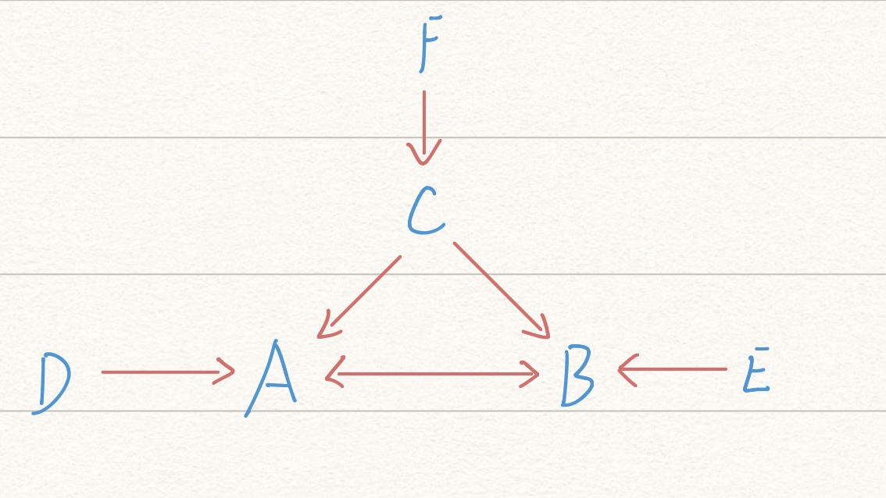

```{r wd}
setwd("/Users/wangpei/OneDrive - National University of Singapore/Curriculum/Sem_04/BT3102/Assignments/Computational-Methods-for-Business-Analytics/Assignment 2/")
getwd()
```

```{r setup, include=FALSE}
knitr::opts_chunk$set(echo = TRUE, warning = FALSE)
library(stargazer)
library(AER)
```

# Q1. You study how sales depend on prices for wine. You believe that rating (i.e., expert ratings) can be an imperfect measure of taste (i.e., true quality). Taste is unobserved because there is no ideal measure for it.

## I. Assume that causal Diagram 1 is correct. Choose sensible parameter values and simulate a data set of N = 10000 observations for 3 variables: ratings, prices, and sales (taste data is removed after the simulation because it is unobserved to the analyst).
```{r q1.1}
set.seed(37)
N = 10000
# taste in (0, 1), 2 decimal places
taste = rnorm(N)

hist(taste)

rating = rnorm(N,taste,2) + rnorm(N)
hist(rating)

price = 10 * taste + rnorm(N)
hist(price)

sales = 10*taste - 10*price + rnorm(N)
hist(sales)
```

## II. Use the data set you just generated and regress sales on price. How does your estimate for the price coefficient differ from its true value? Does including ratings as an independent variable solve the problem? Explain why or why not.
```{r q1.2 regression}
model1 = lm(sales ~ price)
model2 = lm(sales ~ price + rating)
stargazer(model1,model2, type="text",omit.stat=c("LL","ser","f"),
          model.numbers=TRUE, model.names = TRUE)
```

## III. Redo I-II and this time assume that causal Diagram 2 is correct.
```{r q1.3.1}
set.seed(37)
N = 10000
taste = rnorm(N)
rating = rnorm(N,taste,2) + rnorm(N)
hist(rating)
price = 10*rating + rnorm(N)

sales = 10*taste - 10*price + rnorm(N)
hist(sales)
```

```{r q1.3.2}
model3 = lm(sales ~ price)
model4 = lm(sales ~ price + rating)
stargazer(model3,model4, 
          type="text",omit.stat=c("LL","ser","f"),
          model.numbers=TRUE, model.names = TRUE)
```


# Q2
## 2.I
Data generating process: 
$$
\begin{aligned}
\alpha_1 &=0 \\
\alpha_2=\alpha_3=\beta_1 &=\beta_2=\beta_3=\gamma=1
\end{aligned}
$$

```{r Q2.1 DGP}
set.seed(37)
N = 10000

D = rnorm(N)
E = rnorm(N)
F = rnorm(N)
a1=0
a2=a3=b1=b2=b3=g=1

C = g*F + rnorm(N)
A = 0 + a2*C + a3*D + rnorm(N)
B = b1*A + b2*C + b3*E + rnorm(N)
C_measured = C + rnorm(N)
D_measured = D + rnorm(N)
A_measured = A + rnorm(N)
```

### 2.I.1 draw causal diagram


A is correlated with B,C,D,F; depends directly on D,C, indirectly on F.

B is correlated with A,C,D,E,F; depends directly on A,C,E,, indirectly on F,D.

C is correlated with A,B,F; depends directly on F.

D is correlated with A,B; depends on nothing (exogenous).

E is correlated with B; depends on nothing (exogenous).

F is correlated with A,B,C; depends on nothing (exogenous).

### 2.I.2 Show all collider variables and how they may bias estimates.

Collider variables are variables with multiple parents.

A is a collider variable, it will cause endogenous problem if added into regressions of D and C (i.e. D ~ C+A, C ~ D+A yield biased estimates.)

B is a collider variable, it will cause endogenous problem if added into regressions of A, C, E. (i.e. C ~ E+B, E ~ C+B, A ~ C+B, C ~ A+B, A ~ E+B, E ~ A+B, etc.)

### 2.I.3 Which variables to include to predict A? Is the model also a good causal inference model?

Regress A on D and C (A ~ D+C). It is also a good model for causal inference as it captures the true causal relationship (No endogenous problem because all parents of A are included in the regression model).

### 2.I.4 Show whether or not each of following data is enough to identify relation between A and B.
```{r Q2.1.4}
lm1 = lm(B ~ A+C) # ok
lm2 = ivreg(B ~ A|D) # ok
lm3 = lm(B ~ A+E) # bad, omitted variable bias by C
lm4 = lm(B ~ A+F) # bad, omitted variable bias by C
lm5 = lm(B ~ A+C_measured) # bad, measurement error
lm6 = ivreg(B ~ A|D_measured) # ok, but not so accurate
lm7 = ivreg(B ~ A_measured|D) # ok
lm8 = lm(B ~ A_measured+C) # bad, measurement error by A

stargazer(lm1,lm2,lm3,lm4,lm5,lm6,lm7,lm8,
          type="text",omit.stat=c("LL","ser","f"),
          model.numbers=TRUE, model.names = TRUE)
```

Comments on models:

- a: B ~ A + C can identify relation between A and B because E is exogenous and C, which is endogenous, is included in the regression.

- b: B ~ A | D can identify relation between A and B because D is a good instrumental variable as it strongly correlates with A and it correlates with B only through A. 

- c: B ~ A + E cannot identify relation between A and B due to omitted variable bias. C effects both A and B and is omitted in the regression.

- d: B ~ A + F cannot identify relation between A and B because C is omitted in the regression, causing omitted variable bias. F cannot be a instrumental variable as it correlates with B not only through A.

- e: B ~ A + C_measured cannot identify relation between A and B. This is because:
$$
\begin{aligned}
&A = a_0 + a_1C + \epsilon_1 \\
&B = b_0 + b_1 A + b_2 C + \epsilon_2 \\
&C^* = C + \epsilon_3 \\
\implies 
&A = a_0 + a_1 C^* + (\epsilon_1 - a_1 \epsilon_3) \\
&B = b_0 + b_1 A + b_2 C^* + (\epsilon_2 - b_2 \epsilon_3)
\end{aligned}
$$

The error term of B ~ A+C* is correlated C* and A. Thus, the estimation for b1 and b2 are biased.

- f: B ~ A | D_measured can identify the relation between A and B but D_measured is a weaker instrumental variable than D. As shown below, the correlation between A and D_measured is 0.3518, so the estimation bias is larger than B ~ A|D. 
```{r A and D_measured}
cor(A, D_measured)
```

- g: B ~ A_measured | D can identify the relation between A and B because D (the instrumental variable) can fix the attenuation effect of measurement error on A.

- h: B ~ A_measured + C cannot identify the relation between A and B because the error term of the regression is correlated with A_measured, causing biased estimation of b1.

## 2.II
Data generating process: 
$$
\begin{aligned}
\alpha_1=\alpha_2 &=\alpha_3=-0.8 \\
\beta_1=\beta_2 &=\beta_3=-0.5 \\
\gamma &=0.5
\end{aligned}
$$

### 2.II.1



A is correlated with B,C,D,E,F; depends directly on B,C,D, indirectly on E,F.

B is correlated with A,C,D,E,F; depends directly on A,C,E,, indirectly on D,F.

C is correlated with A,B,F; depends directly on F.

D is correlated with A,B; depends on nothing (exogenous).

E is correlated with A,B; depends on nothing (exogenous).

F is correlated with A,B,C; depends on nothing (exogenous).


### 2.II.2
Solution of the simultaneous equations:
$$
\begin{aligned}
A = \frac{(a_1 b_2 + a_2)C + a_3 D + a_1 b_3 E + a_1 \epsilon_3 + \epsilon_2}{1 - a_1 b_1} \\ \\
B = \frac{(a_2 b_1 + b_2)C + a_3 b_1 D + b_3 E + b_1 \epsilon_2 + \epsilon_3}{1 - a_1 b_1}
\end{aligned}
$$
```{r Q2.2.2.1}
set.seed(37)
N = 10000

D = rnorm(N)
E = rnorm(N)
F = rnorm(N)
a1=a2=a3 = -0.8
b1=b2=b3 = -0.5
g = 0.5
e1 = rnorm(N)
e2 = rnorm(N)
e3 = rnorm(N)

C = g*F + e1
A = ((a1*b2+a2)*C + a3*D + a1*b3*E + a1*e3 + e2)/(1-a1*b1)
B = ((a2*b1+b2)*C + a3*b1*D + b3*E + b1*e2 + e3)/(1-a1*b1)
```

```{r Q2.2.2.2}
# increase D by 1
D2 = D+1
A2 = ((a1*b2+a2)*C + a3*D2 + a1*b3*E + a1*e3 + e2)/(1-a1*b1)
A2[1] - A[1] # decrease by 4/3

# increase E by 1
E2 = E+1
A3 = ((a1*b2+a2)*C + a3*D + a1*b3*E2 + a1*e3 + e2)/(1-a1*b1)
A3[1] - A[1] # increase by 2/3

# increase F by 1
F2 = F+1
C2 = g*F2 + e1
A4 = ((a1*b2+a2)*C2 + a3*D + a1*b3*E + a1*e3 + e2)/(1-a1*b1)
A4[1] - A[1] # decrease by 1/3
```

- a: When D increases by 1, A will increase by $\frac{a_3}{1 - a_1 b_1} = -\frac{4}{3}$

- b: When E increases by 1, A will increase by $\frac{a_1 b_3}{1 - a_1 b_1} = \frac{2}{3}$

- c: When F increases by 1, A will increase by $\frac{\gamma(a_2 + a_1 b_2)}{1 - a_1 b_1} = -\frac{1}{3}$


### 2.II.3 Show how you can identify the DGP coefficients.

```{r 2.2.3}
g_lm = lm(C ~ F)  # regress C on F
a1_a2_a3_lm = ivreg(A ~ B+C+D|E+C+D)  # Using E as iv for B
b1_b2_b3_lm = ivreg(B ~ A+C+E|D+C+E)  # Using D as iv for A

stargazer(g_lm, a1_a2_a3_lm, b1_b2_b3_lm,
          type="text",omit.stat=c("LL","ser","f"),
          model.numbers=TRUE, model.names = TRUE)
```

- We can identify $\gamma$ by regress C on F (C ~ F).

- We can identify $\alpha_1,\alpha_2,\alpha_3$ by regress A on C and D and using E as instrumental variable for B.

- We can identify $\beta_1,\beta_2,\beta_3$ by regress B on C and E and using D as instrumental variable for A.

### 2.III Identify model coefficients of given data.

```{r Q2.3}
rm(list=ls())
data = read.csv("hw2q2.csv")
attach(data)

g_lm = lm(C ~ F)  # regress C on F
a1_a2_a3_lm = ivreg(A ~ B+C+D|E+C+D)  # Using E as iv for B
b1_b2_b3_lm = ivreg(B ~ A+C+E|D+C+E)  # Using D as iv for A

stargazer(g_lm, a1_a2_a3_lm, b1_b2_b3_lm,
          type="text",omit.stat=c("LL","ser","f"),
          model.numbers=TRUE, model.names = TRUE)
```

The identified values are:
$$
\begin{aligned}
\alpha_1 &= -0.32 \\
\alpha_2 &= 0.43 \\
\alpha_3 &= -0.58  \\
\beta_1 &= 0.31 \\
\beta_2 &= -0.26 \\
\beta_3 &= 0.54 \\
\gamma &= 0.73 
\end{aligned}
$$

# Q3

## I
```{r q3}
library(stargazer)
library(AER)
data = read.csv("Attend.csv")
data$fresh = as.factor(data$fresh)
data$soph = as.factor(data$soph)
attach(data)

lm1 = lm(stndfnl ~ atndrte+fresh+soph)
summary(lm1)

# Not so confident? May have confounding vars.
```
### I.1


### I.2


## II
```{r q2}
lm2 = lm(stndfnl ~ atndrte+fresh+soph+priGPA+ACT)
summary(lm2)
```
### II.1

### II.2

## III

```{r q3.3}
lm3 = ivreg(stndfnl ~ atndrte + fresh + soph + priGPA + ACT|hwrte)

stargazer(lm1, lm2, lm3, type="text",omit.stat=c("LL","ser","f"),
          model.numbers=TRUE, model.names = TRUE)
```
